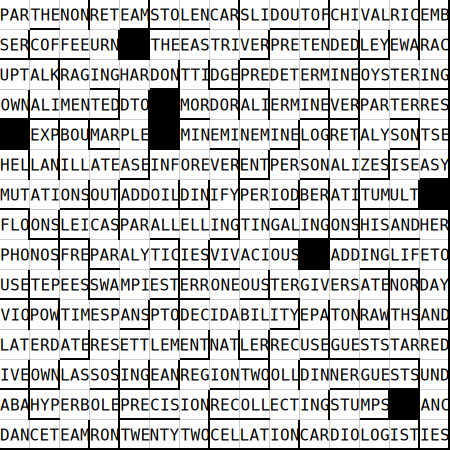

# Crossword Helper CLI

This project is a command-line interface (CLI) tool designed assist in making certain kinds of crosswords.

## Features

- Generate rebus puzzles where every cell contains a specific number of letters.
- For schrodinger puzzles, find words that have similar meanings but specific different letters in a given position, and match in length. I'm calling these "superpuzzitions". This is useful when you already have one superpuzzition and you want to find crossing words that have to now match multiple different letters to fit two grids simultaneously.

## Installation

To get started, clone the repository and install the dependencies:

```bash
git clone https://github.com/1j01/crossword-helper.git
cd crossword-helper
pip install -r requirements.txt
```

## Usage

### `gen-puzzle` command

To generate a crossword, try running the following command:

```bash
python -m src.cli gen-puzzle --max-words 100 --letters-per-cell 3 --format svg >xw.svg
```

Then open xw.svg in your browser or an SVG editor.

See help for more options:
```bash
python -m src.cli gen-puzzle --help
```

Sample output:


(I like the "AMORPHOUS" that ended up in a plus shape. Amorphous+ is a great game.)


### `superpuzzition` command

To find superpuzzitions:
```bash
python -m src.cli superpuzzition --length 5 s p
```

See help for more options:
```bash
python -m src.cli superpuzzition --help
```

Sample output:
```
crims / crimp (score: 0.8819)
situs / situp (score: 0.8657)
geest / geeps (score: 0.8642)
knish / knops (score: 0.8522)
suses / supes (score: 0.8507)
knosp / knops (score: 0.8451)
knops / knosp (score: 0.8451)
chubs / chump (score: 0.8351)
louse / loupe (score: 0.8314)
keles / kelep (score: 0.8279)
agast / agape (score: 0.8230)
stirs / stirp (score: 0.8197)
clees / cleep (score: 0.8172)
chast / chaps (score: 0.8135)
woosy / woops (score: 0.8126)
glums / glump (score: 0.8106)
salps / salop (score: 0.8072)
chast / chape (score: 0.8048)
tipsy / tippy (score: 0.8044)
```

Note that the dictionary has too many uncommon words so the results are very noisy.

I believe that the similarity scores will be less useful for uncommon words, more based on spelling, and more arbitrary, due to the machine learning dataset not having enough examples of these words, which will bias it towards uncommon words. In fact it may consider all unknown words more similar to each other than known words, as a by-product of trying to sort the embeddings to be distant from each other, only for words in the training data.

However there are some gems in the rough:
- crab / ribs (score: 0.5713) could be clued with "Meaty dish"
- vial / labs (score: 0.5460) could be clued with "What may be used for science experiments" (awkwardly avoiding plural/singular hint; probably a better way)
- spas / tubs (score: 0.5303) could be clued with "Places to soak and relax"

A simple fix will be to use a smaller dictionary of more common words, or even a crossword answer database, which would be more suited to the purpose because it could contain multi-word answers and punny nonstandard spellings etc. while being generally more clueable, and perhaps including suggested clues while we're at it.

## License

This project is licensed under CC0 License.
